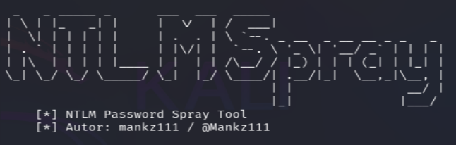
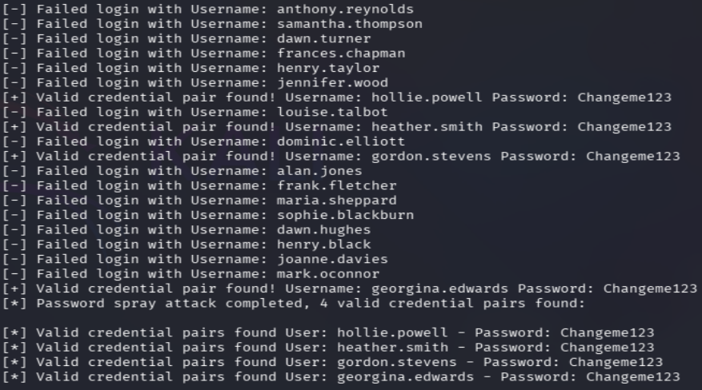

# NTLM Sprayer

Python utility for **Password Spraying** attacks against NTLM authentication. Designed for security auditing and Active Directory laboratory environments.

## Demo Results
<p align="center">
  
</p>

<p align="center">
  
</p>

## Features
* **Summary Report**: Consolidates all valid credentials at the end of the attack.
* **OOP Design**: Built using Object-Oriented Programming for modularity.
* **CLI Focused**: Native terminal experience using `argparse`.

## Usage
```bash
python ntlm_sprayer.py -w users.txt -p Password123 -u [http://target.local/login](http://target.local/login) -f domain.local

1. The "Identity" Problem (FQDN)
In a standard Active Directory (AD) environment, a standalone username like georgina.edwards is often insufficient for authentication. The system needs to know which authority is responsible for that specific user. This is where the Domain (FQDN) becomes critical.

Authentication protocols like NTLM strictly require the DOMAIN\username format. This tool automates this requirement, ensuring your requests are properly formatted for the Domain Controller to understand. Without this "Domain" context, "naked" usernames are typically rejected immediately by the server.

2. Defeating Account Lockout Policies
Traditional brute-forcing—testing hundreds of passwords against a single user—is a high-risk strategy in modern environments. Most Active Directory configurations include Account Lockout Thresholds that disable an account after 3 to 5 failed attempts. This not only stops your testing but also alerts the Blue Team (SOC) instantly.

Password Spraying is the strategic solution to this problem. Instead of attacking one user with many passwords, we test one highly likely password (e.g., Summer2026!) against a large list of users.

Single Attempt: Each account receives only one failed login attempt per cycle.

Stealth: You remain safely below the lockout threshold, avoiding account freezes.

Efficiency: You significantly increase the probability of finding that one user in the organization who used a weak, seasonal, or default password.
